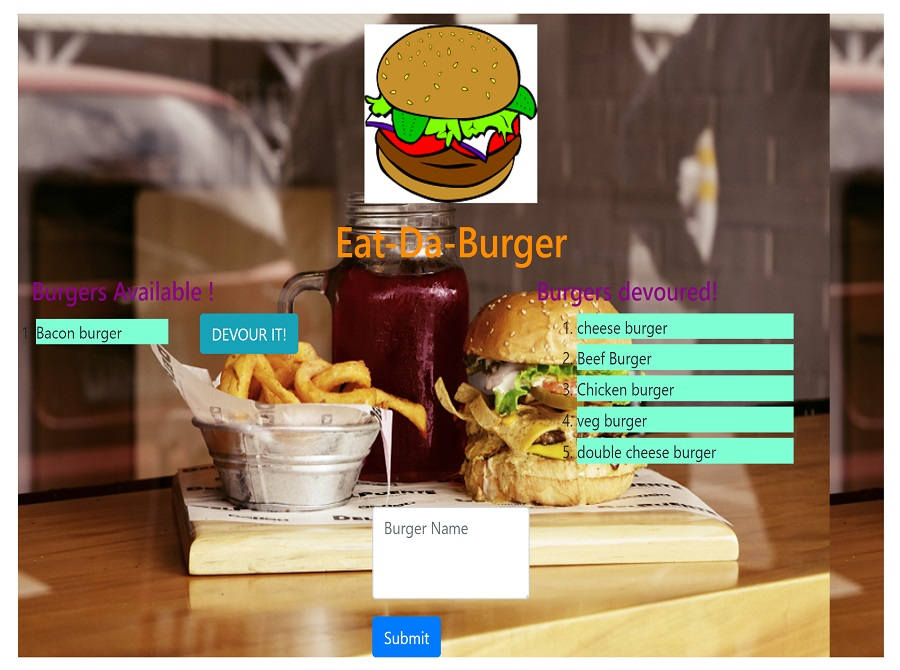
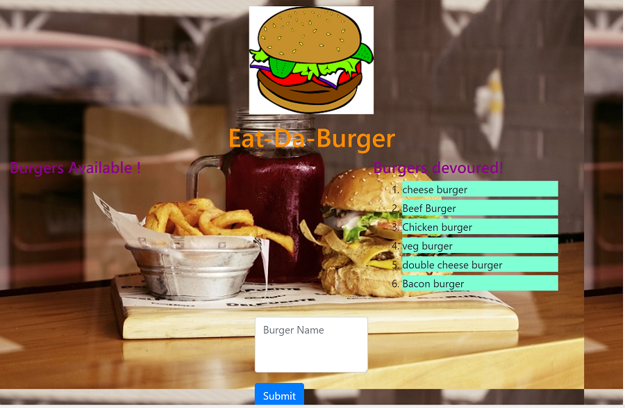

### Burger


### Overview
A burger logger with MySQL, Node, Express, Handlebars and ORM, following the MVC design pattern and using Node and MySQL to query and route data in the app, and Handlebars to generate HTML. It includes the functions below:

* Eat-Da-Burger! is a restaurant app that lets users input the names of burgers they'd like to eat.

* Whenever a user submits a burger's name, your app will display the burger on the left side of the page -- waiting to be devoured.

* Each burger in the waiting area also has a `Devour it!` button. When the user clicks it, the burger will move to the right side of the page.

### App Live Link
https://

### App GitHub Link
https://github.com/helenhao888/Burger.git

### Developer
    Developed by Helen Hao (helenhao888)
    
### Technologies
    Node.js 
    Express
    Handlebars
    ORM
    MySql
    MVC design 
    javascript
    jQuery
    HTML
    CSS
    HeroKu/GitHub

### Screenshots
1. Add a new burger
   Whenever a user submits a burger's name, your app will display the burger on the left side of the page -- waiting to be devoured.
   

2. Devour a burger
    Each burger in the waiting area also has a `Devour it!` button. When the user clicks it, the burger will move to the right side of the page.
   

3. validation check 
   If user doesn't input burger name and press submit button,it displays error message. 
   

#### Directory structure
```
.
├── config
│   ├── connection.js
│   └── orm.js
│ 
├── controllers
│   └── burgers_controller.js
│
├── db
│   ├── schema.sql
│   └── seeds.sql
│
├── models
│   └── burger.js
│ 
├── node_modules
│ 
├── package.json
│
├── public
│   └── assets
│       ├── css
│       │   └── burger_style.css
│       └── img
│
├── server.js
│
└── views
    ├── index.handlebars
    └── layouts
        └── main.handlebars
    └── partials   
        └── burgers
            └── burger-block.handlebars 
```
### Contact Information

   Helen Hao :
   :link:[linkedIn](https://www.linkedin.com/in/jinzhao-helen-hao-611b3752/) 
   :link:[Portfolio](https://helenhao888.github.io)    
